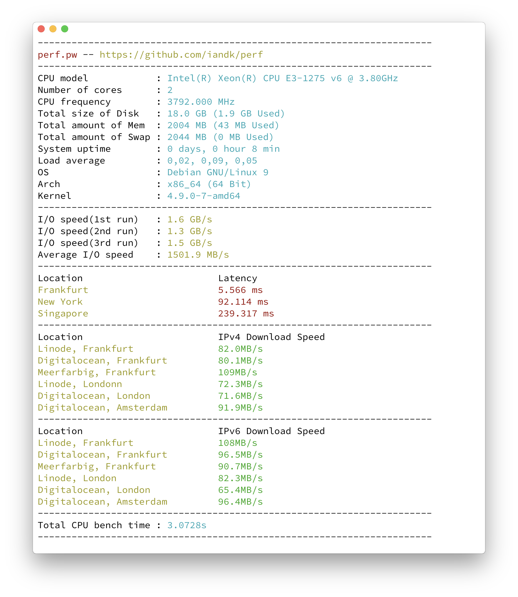

## getsysperf.com
A simple benchmark script to test your Disk, Network and CPU performance on Debian/ Ubuntu based systems.     
&nbsp;
### Usage
You just have to run the command below.
```
wget -qO- https://git.io/fABdu | bash
```
    
If you don't get an output when running the script, make sure the following packages are installed
```
apt install dialog ca-certificates jq curl fio wget iputils-ping
```
&nbsp;
### Donation

[Help me to keep the project alive](http://paypal.me/ianklemm)

### Sample Output



